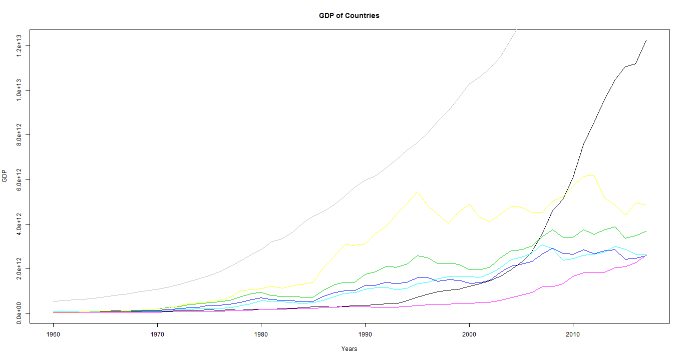
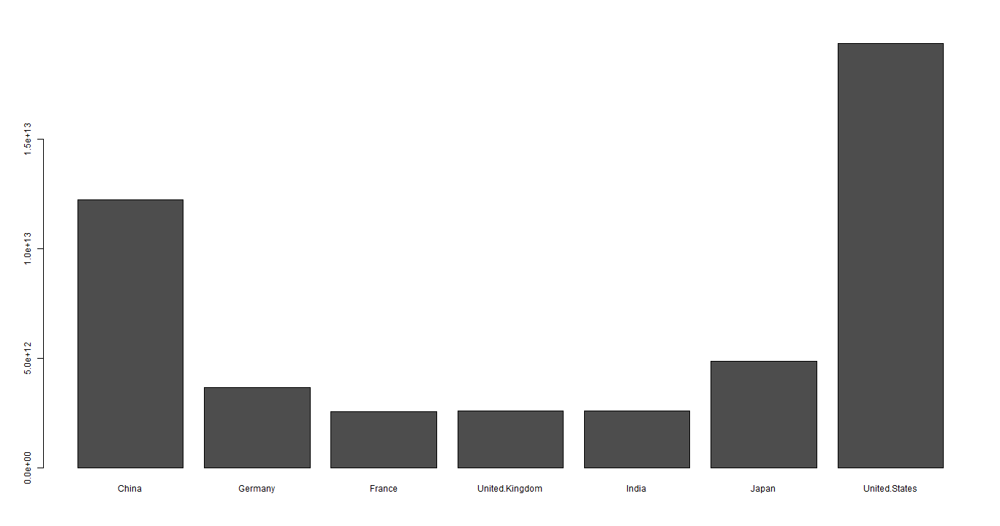

Pitch
========================================================
author: Sushil Kumar Srivastava
date: 08-Aug-2018
autosize: true

GDP Data of top countries
========================================================

We have taken GDP data of top countries from 1960 to 2017. Here are the countries for which we have collected the data:

- United States
- China
- Japan
- Germany
- United Kingdom
- France
- India

Summary of the data
========================================================


```
'data.frame':	58 obs. of  8 variables:
 $ Year          : int  1960 1961 1962 1963 1964 1965 1966 1967 1968 1969 ...
 $ China         : num  5.97e+10 5.01e+10 4.72e+10 5.07e+10 5.97e+10 ...
 $ Germany       : num  NA NA NA NA NA NA NA NA NA NA ...
 $ France        : num  6.27e+10 6.83e+10 7.63e+10 8.56e+10 9.49e+10 ...
 $ United.Kingdom: num  7.23e+10 7.67e+10 8.06e+10 8.54e+10 9.34e+10 ...
 $ India         : num  3.65e+10 3.87e+10 4.16e+10 4.78e+10 5.57e+10 ...
 $ Japan         : num  4.43e+10 5.35e+10 6.07e+10 6.95e+10 8.17e+10 ...
 $ United.States : num  5.43e+11 5.63e+11 6.05e+11 6.39e+11 6.86e+11 ...
```

GDP Graph of the top economies 
========================================================



Current size of GDP of the top economies 
========================================================


